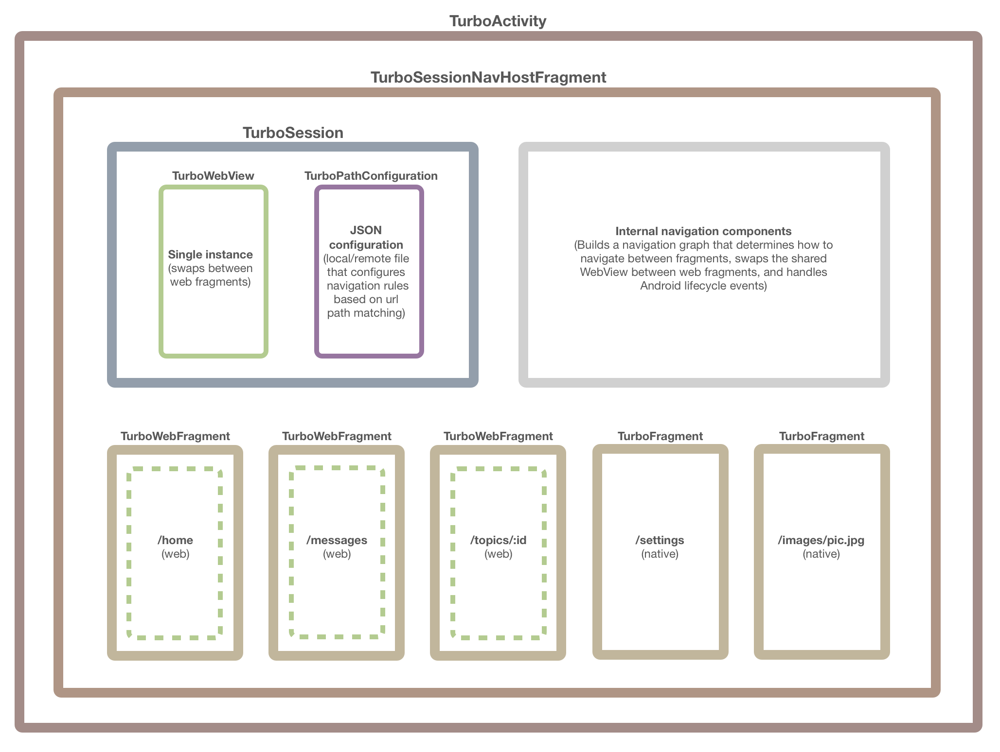

# Overview
Turbo Android is a native adapter for any [Turbo 7](https://github.com/hotwired/turbo)-enabled web app. It enables you to build hybrid (native + web) apps that give you the flexibility to display native screens, `WebView` screens, or a blend of both. It's built entirely using standard Android tools and conventions.

This library has been in use and tested in the wild since June 2020 in the all-new [HEY Android](https://play.google.com/store/apps/details?id=com.basecamp.hey&hl=en_US) app.

## Structure of Your App
Turbo Android uses Google's [Navigation component library](https://developer.android.com/guide/navigation) under the hood to navigate between destinations. It leverages a single-`Activity` architecture and each navigation destination is a `Fragment` that you'll implement in your app. To take advantage of speed improvements that [Turbo](https://github.com/hotwired/turbo) enables for web applications, a single `WebView` instance is swapped between each `TurboWebFragment` destination, so the `WebView` instance and resources don't need to be recreated for each destination.

The structure of your single-`Activity` app will look like the following diagram. The library manages most of the navigation and lifecycle events for you automatically, but you'll need to setup the foundation of your app and each unique `Fragment` destination. We'll walk you through setting up your app in the [Quick Start Guide](QUICK-START.md) instructions.

